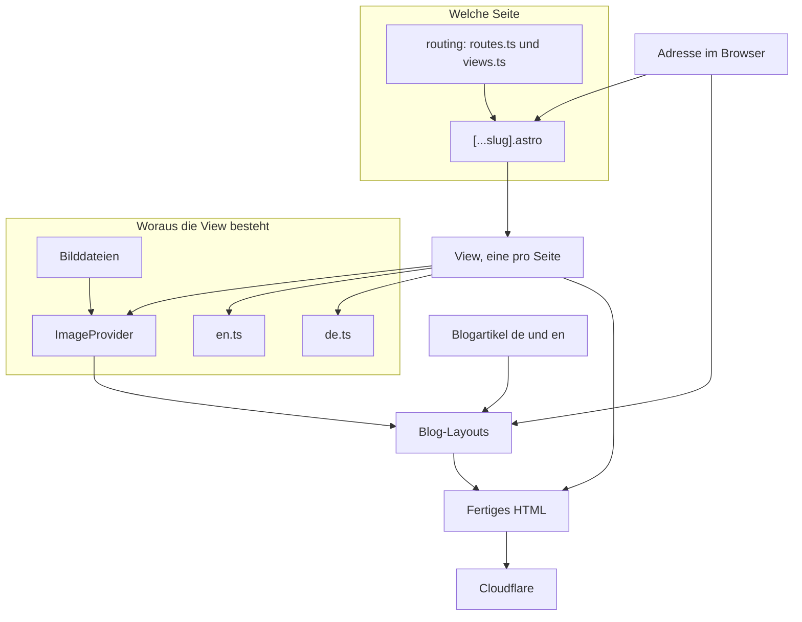

# Pfeil's Cocktail Catering – Website

Texte, Seiten und Bilder pflegst du, indem du dem Agenten in Cursor sagst, was passieren soll. Du musst keine Dateien selbst anlegen. Deutsch ist die Hauptsprache, Englisch legt der Agent dazu an.

Kopiere einen Prompt und ergänze die Stellen in eckigen Klammern.

## Neue Seite

Sag dem Agenten, welche bestehende Seite als Vorbild dient, wie die neue Seite heißen soll und was draufsteht. Bei einem neuen Ort: eigene Texte, nicht nur den Stadtnamen austauschen.

Beispiel, neue Ortsseite:

```text
Lege eine neue Seite für Bergneustadt an, auf Deutsch und Englisch.
Nimm die Seite für Gummersbach als Vorbild, schreibe aber eigene Texte:
Bergneustadt liegt an der Wiehl, typisch sind Firmenevents in Hallen
und private Feiern im Grünen. Andere Fragen in den FAQ als in Köln
und Gummersbach. Überschrift, Absätze und FAQ bitte mitliefern.
Am Ende prüfe die Seite.
```

Beispiel, neues Angebot:

```text
Lege eine Seite für Kaffee-Catering an, auf Deutsch und Englisch.
Orientier dich an der Seite für individuelles Catering.
Inhalt: mobiler Coffee-Truck, für Firmenfeiern und Hochzeiten,
Region Oberberg und Köln. Unten ein Button „Jetzt anfragen“.
Am Ende prüfe die Seite.
```

## Neuer Abschnitt auf einer bestehenden Seite

Sag, auf welcher Seite der Abschnitt hin soll, an welche Stelle, und wie er aussehen soll: Text mit Bild, Aufzählung, Fragen und Antworten, Kundenstimmen oder eine Galerie. Den deutschen Text schreibst du mit. Englisch macht der Agent daraus.

Beispiel:

```text
Auf der Seite Firmenfeier, auf Deutsch und Englisch,
füge hinter dem ersten Text-mit-Bild einen neuen Abschnitt ein.

Der Abschnitt hat links ein Bild und rechts Text.
Überschrift: Die Bambusbar als Treffpunkt
Text: Die Bar steht mitten unter den Gästen. Dort bleibt man stehen,
probiert einen Drink und kommt ins Gespräch. Das Bild hänge ich an,
es ist schon mit Squoosh verkleinert. Darauf die Bambusbar bei Tageslicht
auf einem Firmengelände, davor zwei Barkeeperinnen mit Shakern.
Am Ende prüfe die Seite.
```

## Neuer Blogbeitrag

Ein Beitrag braucht immer zwei Fassungen, Deutsch und Englisch, mit demselben Dateinamen. Der Agent legt beide an. Wenn der Text Fragen beantwortet, sag das dazu. Die Antworten sollen sachlich sein und Pfeil's nicht bewerben. Pfeil's darf im Schluss stehen.

Beispiel:

```text
Lege einen Blogbeitrag auf Deutsch und Englisch an.
Titel: Wie viele Cocktails pro Gast einplanen?
Text: Für einen Empfang von zwei Stunden rechnet man etwa zwei bis drei
Drinks pro Person. Bei einem langen Abend mehr. Keine Werbesprache,
Pfeil's nur im letzten Absatz nennen.
Das Titelbild hänge ich an diese Nachricht. Es ist schon mit Squoosh verkleinert.
Darauf sind sechs Cocktails in einer Reihe auf einem weißen Stehtisch.
Im Hintergrund unscharf eine Bambusbar und Personen mit Gläsern.
Am Ende prüfe den Beitrag.
```

## Neues Bild

### 1. Zuerst verkleinern

Bilder kommen nicht roh ins Projekt. Öffne [Squoosh](https://squoosh.app) im Browser, zieh das Foto hinein und speichere es kleiner ab.

- Format: WebP. Bei Logos, die durchsichtig sein müssen, PNG.
- Zieh die Qualität herunter, bis die Datei klein ist und Gesichter, Gläser und Schrift noch scharf sind. Wenn es matschig wird, Qualität wieder hoch.
- Lange Kante ungefähr 2000 Pixel. Größer bringt auf der Website nichts.

Lade die Datei herunter. Den Dateinamen klein und mit Bindestrichen, zum Beispiel `hochzeit-bambusbar-abend.webp`.

### 2. In den Chat ziehen

Die heruntergeladene Datei aus Squoosh ziehst du in den Chat. Den Ordner suchst du nicht aus. Der Agent speichert das Bild selbst.

Du beschreibst dazu selbst, was auf dem Foto zu sehen ist, in ein bis zwei Sätzen. Der Agent übernimmt deine Worte für die Bildbeschreibung auf Deutsch und übersetzt sie ins Englische. Schreib, was darauf ist, nicht „schönes Bild“ oder „Foto 1“.

Sag auch, wo es erscheinen soll.

Beispiel, Foto auf einer Seite:

```text
Ich möchte ein Bild einfügen.

Darauf steht die beleuchtete Bambusbar abends auf einer Hochzeit.
Im Vordergrund vier bunte Cocktails, dahinter warmes Licht und Gäste an Stehtischen.

Bitte in der Hochzeits-Galerie einbauen.
Diese Beschreibung auf Deutsch und Englisch als Bildtext verwenden.
Am Ende prüfe die Seite.
```

Beispiel, Bild über einem Blogartikel:

```text
Ich möchte ein Bild einfügen.

Zu sehen sind sechs Cocktails in einer Reihe auf einem weißen Stehtisch.
Hintergrund unscharf: Bambusbar und Personen mit Gläsern.

Das soll das große Bild über dem Beitrag
„Wie viele Cocktails pro Gast einplanen?“ sein.
Diese Beschreibung auf Deutsch und Englisch verwenden. Am Ende prüfe den Beitrag.
```

Der Agent legt die Datei unter `src/assets/images/` ab, je nachdem was darauf zu sehen ist: Feiern unter `events`, Essen und die Bar unter `catering`, einzelne Drinks unter `cocktails`, das große Bild oben auf einer Seite unter `hero`, Orte unter `service-areas`, Teamfotos unter `team`, reine Blogbilder unter `blog`, Partnerlogos unter `logos`.

## Architektur

Eine Marketing-Seite gibt es einmal als Datei unter `src/views/`. Der Dateipfad ist die deutsche URL, zum Beispiel `src/views/einsatzgebiete/koeln.astro`. Dieselbe Datei liefert Deutsch und Englisch. Die Sprache kommt aus der Adresse: ohne Vorsilbe Deutsch, mit `/en/` Englisch. Texte kommen aus `de.ts` und `en.ts`.

Welche Seiten es gibt, steht in `src/routing/`: `routes.ts` hält deutschen und englischen Pfad, `views.ts` die zugehörige View. Beide benutzen denselben Schlüssel, und TypeScript verlangt zu jedem Pfad eine View.

```ts
// routes.ts
"einsatzgebiete/koeln": "service-areas/cologne",
// views.ts
"einsatzgebiete/koeln": Koeln,
```

Bilder liegen als Dateien im Projekt. Der `ImageProvider` ist die Karteikarte dazu: Datei, deutsche Beschreibung, englische Beschreibung. Die View fragt den Provider, nicht den Dateipfad.

Blogartikel sind eigene Texte, je einer auf Deutsch und einer auf Englisch. Sie laufen nicht durch die Views, sondern durch die Blog-Layouts.

Astro baut daraus fertige HTML-Seiten. Cloudflare liefert sie aus.



## Für die technische Einrichtung

```bash
npm install
npm run dev          # Seite lokal ansehen: http://localhost:4321
npm run check        # Prüfung nach Änderungen: Inhalte, Sitemap, robots, ob die Seiten rendern
npm run deploy:dev   # Test-Veröffentlichung
npm run deploy:prod  # Live-Veröffentlichung
```
